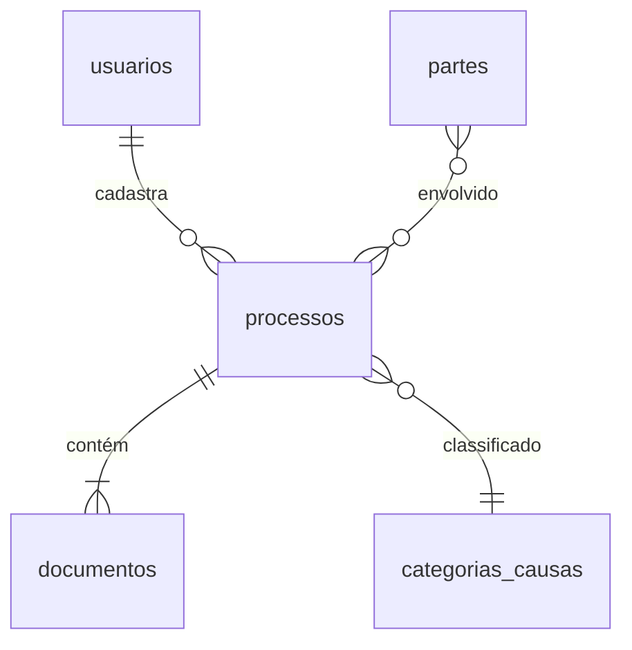

# 📂 Sistema JEC - Documentação Técnica

*CLI para Gestão de Juizados Especiais Cíveis*

---

## 🔍 Índice
1. [Visão Geral](#-visão-geral)
2. [Arquitetura](#-arquitetura)
3. [Banco de Dados](#-banco-de-dados)
4. [Autenticação](#-autenticação)
5. [Funcionalidades](#-funcionalidades)
6. [Roadmap](#-roadmap)
7. [Testes](#-testes)
8. [Especificações Técnicas](#-especificações-técnicas)
9. [Equipe](#-equipe)

---

## 🌐 Visão Geral

```json
{
  "projeto": {
    "nome": "Sistema JEC",
    "tipo": "CLI Python",
    "interface": "Rich",
    "escopo": "Gestão completa de processos judiciais",
    "usuarios_concorrentes": 15
  }
}
```

**Objetivos Principais:**
- Automatizar gestão de processos cíveis
- Centralizar informações de partes envolvidas
- Gerar relatórios e alertas de prazos

---

## 🏗 Arquitetura

### Estrutura de Arquivos
```
raiz/
├── main.py            # Ponto de entrada
├── database.py        # Conexão PostgreSQL
├── auth.py            # Autenticação PBKDF2
├── config.py          # Configurações e temas
├── rich_cli.py        # Interface Rich
├── logger.py          # Sistema de logs
└── tests/             # Testes unitários
```

### Módulos Nucleares
| Módulo       | Descrição                          | Status                |
|--------------|------------------------------------|-----------------------|
| `Database`   | Pool de conexões e queries         | ✔️ Implementado       |
| `Auth`       | Login com hash seguro              | ✔️ Implementado       |
| `Rich_CLI`   | Interface interativa               | ✔️ Implementado       |
| `Logger`     | Rastreamento de atividades         | ✔️ Implementado       |
| `Main`       | Rastreamento de atividades         | 🚧 Em desenvolvimento |

---

## 🗃 Banco de Dados

### Configuração .env

DB_HOST=192.168.1.66
DB_PORT=5432
DB_USUARIO=postgres
DB_SENHA=my_password
DB_NOME=postgres
DB_SCHEMA=jec

DEBUG=False

### db info/schema

```sql
SELECT table_name
FROM information_schema.tables
WHERE table_schema = 'jec';

query result:
"usuarios"
"partes"
"categorias_causas"
"processos"
"partes_processo"
"documentos"
"processos_ativos"

SELECT 
    column_name, 
    data_type, 
    character_maximum_length, 
    numeric_precision, 
    numeric_scale,
    is_nullable,
    column_default
FROM information_schema.columns
WHERE table_schema = 'jec' 
  AND table_name = 'usuarios'
ORDER BY ordinal_position;

query result:
"id"	"uuid"				"NO"	"public.uuid_generate_v4()"
"cpf"	"character varying"	14			"NO"	
"nome_completo"	"character varying"	100			"NO"	
"email"	"character varying"	100			"NO"	
"senha"	"character varying"	255			"NO"	
"tipo"	"character varying"	20			"NO"	
"telefone"	"character varying"	20			"YES"	
"data_cadastro"	"timestamp without time zone"				"YES"	"CURRENT_TIMESTAMP"
"ultimo_login"	"timestamp without time zone"				"YES"	


SELECT 
    tc.table_name, 
    kcu.column_name, 
    tc.constraint_type
FROM 
    information_schema.table_constraints tc
    JOIN information_schema.key_column_usage kcu
    ON tc.constraint_name = kcu.constraint_name
WHERE tc.table_schema = 'jec' 
  AND tc.table_name = 'usuarios'
  AND tc.constraint_type = 'PRIMARY KEY';

query result:
"usuarios"	"id"	"PRIMARY KEY"


SELECT * FROM jec.usuarios;

query result:
"d6b4fc29-fe06-4998-86b3-2ea18d5da461"	"65465465454"	"Toda"	"toda@gmail.com"	"pbkdf2:sha256:600000$5d10d703a4c209444a04cfeb98e7b020$3859880b1ebd6b4a88bdee777bd586537d14beb55f12ab5c9aa06e63599f6be5"	"juiz"		"2025-04-11 02:39:41.776687"	
"fe7c837a-fbcf-4b47-ad63-e6cc26b5cb3b"	"00000000000"	"vvvvvvvvv dddddd"	"dddddd.ddddd@gggg.cccc"	"pbkdf2:sha256:600000$d84e0a048bbb5d82f5ea314006c12bd7$8e3fc8f763d7da1b4e8897bb09ff248b2fdf1200bbf6511ff20d7e3202c71315"	"juiz"		"2025-03-28 16:53:44.539278"	"2025-04-02 16:51:42.379772"
"9bea0923-ab64-4e60-8e6b-3230439581ba"	"35735735757"	"Diego souza"	"di@gmail.com"	"pbkdf2:sha256:600000$2b2ba74b10e5a615ca620da391bd3c44$1a5e3f20556186d4857ad572ed24b3705ab846dd8863d74f9564836931254535"	"juiz"		"2025-04-11 02:20:41.241997"	
"18655835-a61a-4d6e-ae1b-2fd0beb0f9b5"	"40935935827"	"VICTOR RABELLO DIDIER"	"victor.didier@gmail.com"	"pbkdf2:sha256:600000$cc2f464edd03c4c2b6de3e974a28120c$d59daf2dfc4cbd70b713b93a19a7c1fa943ac6981a8ec724433fca88ec7be18f"	"servidor"	"+55 11 99442-4200"	"2025-04-02 16:57:00.650645"	"2025-04-02 16:58:02.292646"
```

### Diagrama de Tabelas (Schema JEC)


**Principais Entidades:**
1. `usuarios` (servidores, juízes, advogados)
2. `processos` (casos judiciais)
3. `documentos` (petições, decisões)
4. `partes` (autor/réu)

---

## 🔐 Autenticação

### Esquema de Segurança
| Parâmetro           | Valor                     |
|---------------------|---------------------------|
| Algoritmo           | PBKDF2-HMAC-SHA256        |
| Iterações           | 600,000                   |
| Armazenamento       | Salt (16 bytes) + Hash    |
| Expiração de Sessão | 30 minutos                |


---

## 🛠 Funcionalidades

### Core (v0.6)
- [x] CRUD de usuários
- [ ] Funcionalidades CRUD avançadas para Usuarios e outras em geral
- [ ] Cadastro de processos
- [ ] Vinculação de partes
- [ ] Upload de documentos

### Futuras Versões
- Calendário de audiências
- Integração com PJe/ESAJ
- Relatórios analíticos

---

## 🗺 Roadmap

| Versão | Status      | Descrição                                                  |
|--------|-------------|------------------------------------------------------------|
| v0.4   | ✔️ Concluído | Sistema de logging                                        |
| v0.5   | ✔️ Concluído | Testes integrados                                         |
| v0.6   | 🚧 Andamento | Menu principal (main.py)                                  |
| v0.7   | ⏳ Pendente  | Gerenciamento completo de usuarios, processos, etc        |

---

## 🧪 Testes

**Estratégia:**
```json
{
  "metodologia": "TDD com pytest",
  "cobertura": {
    "modulos_testados": ["auth", "database", "logger", "rich_cli"],
    "pendentes": ["main"]
  },
  "git": "Commits por feature testada"
}
```

---

## ⚙ Especificações Técnicas

### Ambiente
| Componente | Especificações                          |
|------------|-----------------------------------------|
| Servidor   | Acer 2020 (i5, 20GB RAM, PostgreSQL)   |
| Dev        | Lenovo 2014 (i7, 16GB RAM, Win11)      |
| Rede       | Wi-Fi LAN                               |

### Dependências
```requirements.txt
psycopg2-binary
python-dotenv
rich
passlib
pytest
pytest-mock
pytest-cov
pytest-xdist
```

---

## 👨‍💻 Equipe

```json
{
  "desenvolvedor": {
    "nome": "Victor Didier",
    "contato": "victor.didier@gmail.com",
    "skills": ["Python", "SQL", "UI/UX"],
    "localizacao": "São Paulo, Brasil"
  },
  "entrega": {
    "prazo": "7 dias",
    "prioridade": "gestao_documentos"
  }
}
```

---

## 📝 Notas de Revisão

**Pendências Críticas:**
1. Finalizar integração e testes de `main.py`
2. Revisar tratamento de erros em transações
3. Implementar backup automático