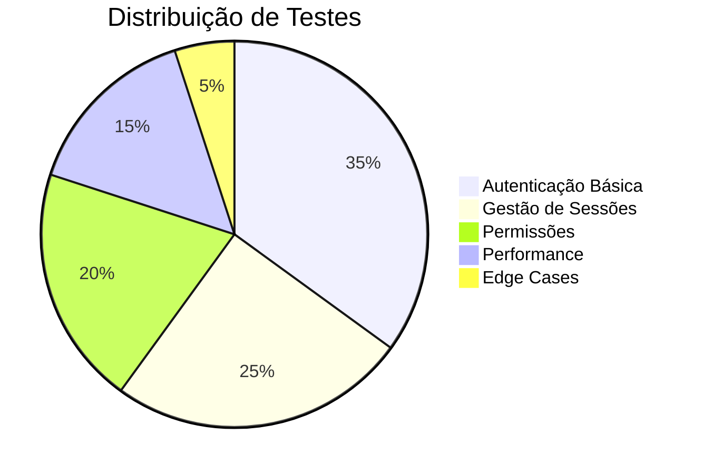

# Sistema JEC

Uma aplicação de interface de linha de comando (CLI) para gerenciamento de casos de juizados especiais cíveis.

## Visão Geral do Projeto

O Sistema JEC é uma aplicação CLI desenvolvida em Python com interface Rich, focada na gestão de processos em juizados especiais cíveis. A aplicação foi projetada para suportar até 15 usuários simultâneos e oferece funcionalidades robustas para o gerenciamento de casos jurídicos.

### Versões
- **v0.0**: Proposta inicial (Fevereiro/2025)
- **v0.1**: Implementação do núcleo + autenticação (04/04/2025)
- **v0.2**: Otimização do pool de conexões com o banco de dados ✓
- **v0.3**: Integração da UI através dos arquivos rich_cli e config ✓
- **v0.4**: Implementação do sistema de logging com logger.py ✓
- **v0.5**: Teste geral de todos os módulos ✓
- **v0.6**: Implementação do main.py ✓
- **v0.7**: TESTE GERAL DE INTEGRACAO ✓
- **v0.8+**: Implementação E TESTES especificos de integracao de login, gerenciamento completo de usuários, documentos e processos, etc *EM PROCESSO*

### Prioridades Atuais
- Prazo: 7 dias
- Foco prioritário: Gerenciamento de documentos
- Restrições: Uso interno somente

### Implementação em Andamento
- Conexão com banco de dados
- CRUD básico de usuários
- Funções e queries básicas
- CRUD básico de PROCESSOS
- [...]

### Padrões de Código
- Tratamento de erros
- Validação de parâmetros
- Robustez da conexão
- Configuração através de variáveis de ambiente

## Funcionalidades

### Essenciais
- **Gerenciamento de Login e Temas**: CRUD e autenticação
- **Gerenciamento de Usuários**: CRUD e autenticação
- **Gerenciamento de Processos**: CRUD e autenticação
- **Rastreamento de Processos**: Status e prazos

### Futuras
- **Calendário**: Audiências e compromissos
- **Integrações**: PJe e Esaj
- **Escalabilidade**: Dados flexíveis seguindo princípios DRY

## Requisitos de Interface (UI)

### Componentes
- Barras de progresso
- Seletor de tema
- Tela de login

### Navegação
- Restrições para visitantes
- Pré-visualizações rápidas

## Estrutura de Arquivos

Todos os arquivos estão localizados na raiz do projeto:

### Arquivos Principais
- **main.py**: Ponto de entrada e tela inicial
- **database.py**: Gerenciador de conexões e consultas ao banco PostgreSQL
- **auth.py**: Gerencia autenticação, hash de senhas (PBKDF2-HMAC-SHA256) e sessões
- **config.py**: Gerencia configurações básicas
- **rich_cli.py**: Define interface com Rich e implementa funcionalidades principais
- **logger.py**: Gerencia logs detalhados em subdiretório logs/ com 3 categorias principais

### Arquivos de Suporte
- .env
- .gitignore
- .venv
- logging_context.py
- db_mgmt\table_structure.py
- db_mgmt\query_runner.py
- db_mgmt\export_handler.py
- db_mgmt\data_preview.py
- db_mgmt\services\validation.py
- db_mgmt\services\security.py


### Template do arquivo .env
```
DB_HOST=
DB_PORT=
DB_USUARIO=
DB_SENHA=
DB_NOME=
DB_SCHEMA=jec
```

## Módulos Nucleares

### Configuração
- **Temas**: padrão, claro, escuro
- **Funcionalidades**: esquemas de cores

### Banco de Dados
- **Tipo**: PostgreSQL
- **Conexão**:
  - Pool: SimpleConnectionPool
  - Conexões: mínimo 1, máximo 5
  - Timeout: 30 segundos
  - Tentativas de reconexão: 3

### Autenticação
- **Segurança**:
  - Algoritmo: PBKDF2-HMAC-SHA256
  - Iterações: 600.000
  - Tempo de expiração da sessão: 30 minutos
- **Perfis de Usuários**: advogado, juiz, servidor, parte, visitante

### Menus
- Atalhos
- Contexto dinâmico
- Entrada SQL

### Serviços
- Entidades correspondentes à estrutura do banco de dados


## Testes

### Metodologia
Utilizamos Desenvolvimento Guiado por Testes (TDD) com pytest, implementando testes de integração entre os módulos de autenticação e banco de dados. Os testes são executados em três níveis de verificação:

- **Camada CLI**: Validação da interface com o usuário
- **Camada de Sessão**: Controle de estado da autenticação
- **Camada de Banco de Dados**: Consistência dos registros

Princípios adotados:
✔ Geração de dados dinâmicos para evitar conflitos  
✔ Limpeza automática de recursos após testes  
✔ Monitoramento de performance (tempos de execução)  
✔ Logs estruturados para rastreabilidade  

### Estratégia
Sistema híbrido de execução:

1. **Modo Interativo**:
   - Menu CLI para seleção individual de testes
   - Ideal para desenvolvimento e debug
   - Feedback visual imediato via Rich

2. **Modo Automatizado**:
   - Execução completa da suíte de testes
   - Pausas reguladas entre cenários
   - Relatório consolidado ao final

3. **Verificação Tripla**:
   - Consistência entre:
     * Interface do usuário
     * Estado da sessão
     * Registros no banco

### Cobertura Atualizada

**Módulos Principais Testados**:
- `auth.py`: Ciclo completo de autenticação (login, sessão, permissões)
- `database.py`: Operações CRUD e transações
- `rich_cli.py`: Componentes de UI e fluxos interativos  
- `logger.py`: Rastreamento de eventos e auditoria

**Cenários Validados**:
✅ Autenticação válida (incluindo PBKDF2)  
✅ Tratamento de credenciais inválidas  
✅ Bloqueio após 3 tentativas falhas  
✅ Migração de senhas legadas  
✅ Expiração de sessão por inatividade  
✅ Ciclo completo de usuários (CRUD)  
✅ Controle de acesso por perfis  

**Métricas de Qualidade**:
- Tempo médio de autenticação: **<550ms**
- Precisão no timeout de sessão: **100%**
- Limpeza de dados temporários: **Automática**
- Consistência entre camadas: **Verificada**

**Novos Recursos Testados**:
- Sistema de timeout de sessão
- Atualização em tempo real de atividade
- Validação de complexidade de senhas
- Controle de concorrência básico




### Integração com Git
Commits por módulo testado

## Especificações Técnicas

### Requisitos do ambiente virtual
- psycopg2-binary
- python-dotenv
- rich
- pytest

## Configuração do Banco de Dados

- **Usuário**: postgres
- **Schema**: jec

### Estrutura de Tabelas (schema jec)

#### 1. usuarios
- Campos: `id`, `cpf`, `nome_completo`, `email`, `senha`, `tipo`
- Restrições: valores únicos em `cpf` e `email`

#### 2. audit_log
- Campos: `user_id`, `action`, `description`, `ip_address`, `timestamp`
- FK: `user_id → usuarios(id)`

#### 3. categorias_causas
- Campos: `nome`, `descricao`, `valor_maximo`, `categoria_pai_id`
- FK: `categoria_pai_id → categorias_causas(id)`

#### 4. documentos
- Campos: `tipo`, `nome_arquivo`, `caminho_arquivo`, `processo_id`, `obrigatorio`
- FK: `processo_id → processos(id)`

#### 5. partes
- Campos: `tipo`, `nome`, `cpf_cnpj`, `advogado_id`
- Restrição: valores únicos em combinação [`tipo`, `cpf_cnpj`]
- FK: `advogado_id → usuarios(id)`

#### 6. partes_processo
- Campos: `processo_id`, `parte_id`, `tipo`, `principal`
- Restrição: valores únicos em combinação [`processo_id`, `parte_id`, `tipo`]
- FKs: `processo_id → processos(id)`, `parte_id → partes(id)`

#### 7. processos
- Campos: `numero_processo`, `titulo`, `categoria_id`, `subcategoria_id`, `valor_causa`, `status`, `juiz_id`, `servidor_id`
- Restrição: valor único em `numero_processo`
- FKs: `categoria_id`, `subcategoria_id → categorias_causas(id)`; `juiz_id`, `servidor_id → usuarios(id)`

## Implementação da Autenticação

### Algoritmo de Hash
- **Algoritmo**: PBKDF2-HMAC-SHA256
- **Biblioteca**: hashlib
- **Tamanho do salt**: 16 bytes
- **Iterações**: 600.000

### Funções Principais

#### hash_password
- **Entrada**: senha, salt opcional
- **Comportamento**: Gera salt aleatório se não fornecido, aplica PBKDF2 e retorna string formatada

#### verify_password
- **Entrada**: hash armazenado, senha fornecida
- **Comportamento**: Recomputa o hash com os mesmos parâmetros e compara usando `compare_digest`

#### migrate_password_on_login
- **Condição**: Se um hash legado for detectado e a autenticação for bem-sucedida
- **Ação**: Re-hash com PBKDF2 e atualiza no banco de dados

#### validate_password_complexity
- **Regras**:
  - Comprimento mínimo: 8 caracteres
  - Exigência de letras maiúsculas
  - Exigência de letras minúsculas
  - Exigência de dígitos
  - Exigência de caracteres especiais

### Fluxo de Segurança
- **Cadastro**: validação → hash → armazenamento
- **Login**: verificação → re-hash se necessário
- **Alteração de senha**: validação → re-hash → atualização

### Proteção Contra
- Ataques de rainbow table
- Força bruta (devido ao alto número de iterações)
- Timing attacks (via comparação constante)